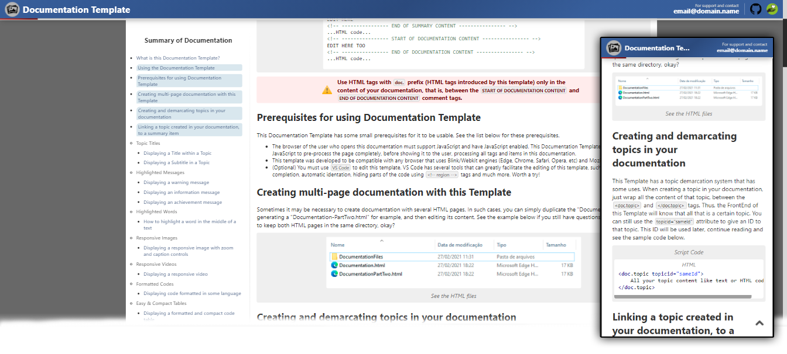

    

# To use this template

To use this Documentation Template just clone this repository (like ZIP for example), then go to the "Documentation-Template" folder and edit the "Documentation.html" file.
 It is recommended that you have knowledge of HTML (at least the basics) to edit this template.

# How to edit this Template

When you open the "Documentation.html" file with your browser, you will be able to see the Template working and you will automatically be able to read everything you need to know to edit and use this Template to its full potential.

# Support projects like this

If you liked this Documentation Template and found it useful for your projects, please consider making a donation (if possible). This would make it even more possible for me to create and continue to maintain projects like this, but if you cannot make a donation, it is still a pleasure for you to use it! Thanks! 😀

 

    

