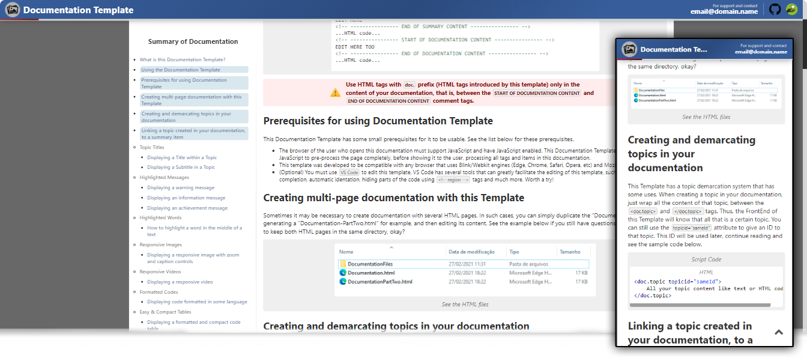

    
    Clone this repository and open the file "Documentation.html" (present in "Documentation-Template") to see this Template working.

# To use this template

To use this Documentation Template just clone this repository (like ZIP for example), then go to the "Documentation-Template" folder and edit the "Documentation.html" file.
 It is recommended that you have knowledge of HTML (at least the basics) to edit this template. <b>If you use this template, please also consider leaving a link to this repository at the footer of your documentation, so that more people can get
  to know this template!</b>

# How to edit this Template

When you open the "Documentation.html" file with your browser, you will be able to see the Template working and you will automatically be able to read everything you need to know to edit and use this Template to its full potential.

# What is the magic behind this Template?

This template is compatible with Mobile devices and Desktops, has a professional design and great basic and advanced features for creating Documentations. This template can read some new tags that only work on it (like `<doc.table>`, `<doc.code>`, `<doc.detach>` and many others) and so you can create structures (such as code boxes with syntax highlighting, responsive images, word highlights, etc.) in your documentation, without worrying about lines and more lines of HTML code that eventually become a headache.

# Support projects like this

If you liked this Documentation Template and found it useful for your projects, please consider making a donation (if possible). This would make it even more possible for me to create and continue to maintain projects like this, but if you cannot make a donation, it is still a pleasure for you to use it! Thanks! 😀

 

    

 

Created with ❤ by Marcos Tomaz

